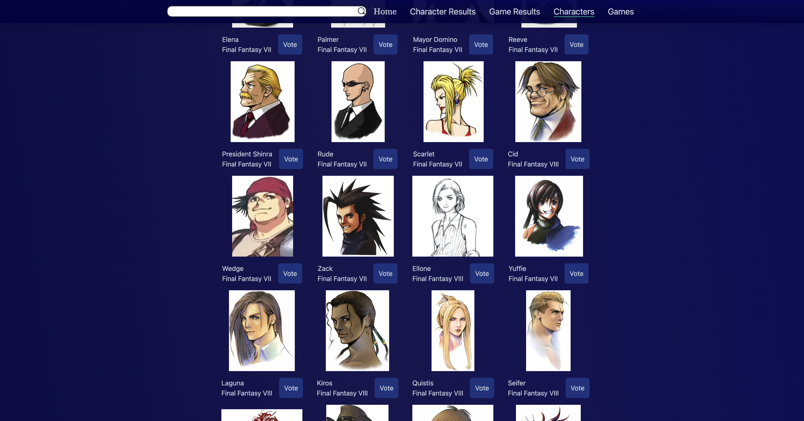

# Final Fantasy Fan Vote

## The Goal
I wanted to build something that included something I am passionate about. The Final Fantasy series holds a special place in my heart and when I found
an api that had a lot of data on the series, I had to build something with it. Final Fantasy Fan Vote lets users vote for their favorite characters and games as well as
track current rankings via the results pages. Special thanks to the [MoogleApi](https://www.moogleapi.com/) and [Jack Perry Jr](https://github.com/jackfperryjr?tab=overview&from=2023-03-01&to=2023-03-06) for creating the moogleApi for the rest of us Final Fantasy Fans!

## Tech Used
When I heard about the [T3 stack](https://create.t3.gg/), I was instantly excited to start learning more about it. It offers
typesafety on both the front and backend and seemed easier to setup full stack projects then some of the other ways I had done before.
The stack includes some of the following:

**Frontend**
- Nextjs
- TailwindCss
- Typescript

**Backend**
- Postgresql
- Prisma
- TRPC
- Typescript
## ScreenShots

